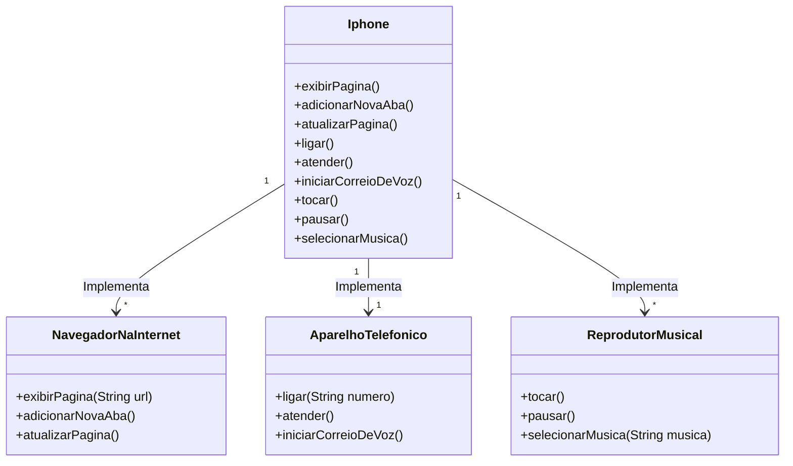

### MODELAGEM DA CLASSE IPHONE

```mermaid
classDiagram

    class  ReprodutorMusical{
        +tocar()
        +pausar()
        +selecionarMusica(String musica)
    }

    class AparelhoTelefonico{
        +ligar(String numero)
        +atender()
        +iniciarCorreioDeVoz()
    }
    class NavegadorNaInternet{
        +exibirPagina(String url)
        +adicionarNovaAba()
        +atualizarPagina()
    }

    class Iphone{
        +exibirPagina()
        +adicionarNovaAba()
        +atualizarPagina()
        +ligar()
        +atender()
        +iniciarCorreioDeVoz()
        +tocar()
        +pausar()
        +selecionarMusica()
    }

    Iphone "1" --> "*" NavegadorNaInternet : Implementa
    Iphone "1" --> "1" AparelhoTelefonico : Implementa
    Iphone "1" --> "*" ReprodutorMusical : Implementa
```
